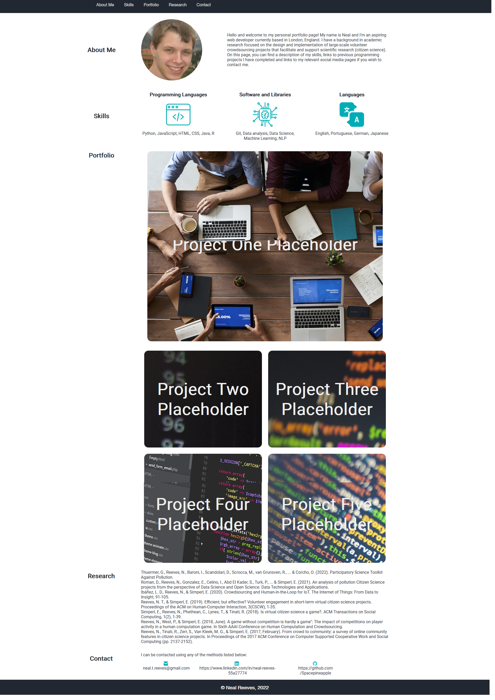

# Portfolio Page Challenge

## Table of Contents
1. [URL](#url)
2. [Description](#description)
3. [Installation](#installation)
4. [Usage](#usage)
5. [Credits](#credits)

## URL 

A live version of this page has been deployed at
https://spacepineapple.github.io/module-2-challenge/ .

## Description 

This landing page was created as my solution to the second challenge task of a
web development bootcamp. For this task, very basic starter code was presented
as an initial outline for the task, although I did not use this code. My task
was as follows:

1. Create a portfolio page combining (at a minimum) flexbox, CSS variables and
   media queries
2. Include my name, a recent photograph and sections about me, my work, and how to contact me
3. Include a navigation bar with links and a UI that scrolls to the corresponding section
4. Populate the section about my work with titled images of my applications
5. Ensure that the first application image is larger in size than the others
6. Ensure that when images of the applications are clicked, the user is taken to
   that deployed application
7. Ensure that when the page is resized or viewed on various screens and devices
   then the layout is responsive and adapts to the viewport

The appearance of the page is as follows: 

## Installation 

All of the required files are included in this repository and no installation
should be required. The index.html file should render in any modern browser on
both a desktop or mobile device. 

## Usage 

To use the files within this repository, first download the repository and then
open the index.html file in any browser. This page uses 

## Credits 

This project was completed by myself -- Neal Reeves -- using freely available
icons and images. All of these images and icons use the MIT license, the details
of which can be found at: https://opensource.org/licenses/MIT
